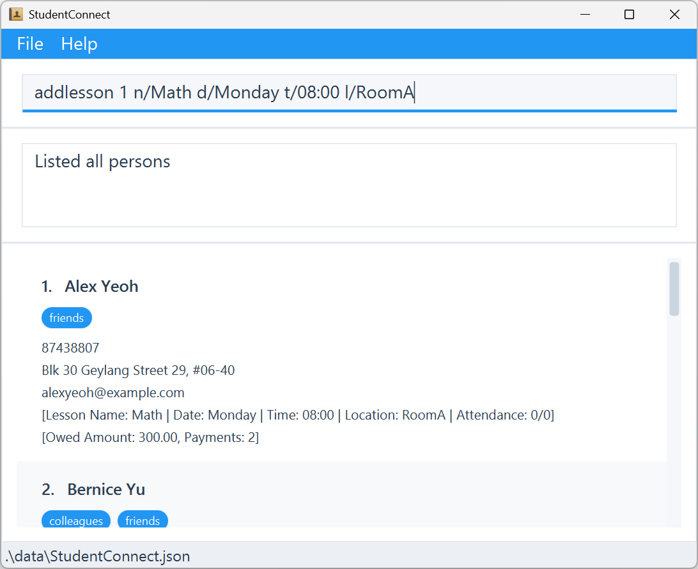

# **StudentConnect**

## Overview

**StudentConnect** helps private tutors and teachers manage multiple students in one place. It simplifies organizing student contacts, lesson notes, progress tracking, and tuition fee records—reducing admin work so educators can focus on teaching.

 

## Key Features

### Student Management

* Centralize student profiles with contact info and subjects.

### Lesson Notes & Progress

* Record lesson notes and track academic progress.

### Tuition Tracking

* Monitor fees owed, paid, and overdue with clear histories.

### Scheduling

* Organize lesson schedules and avoid conflicts.

 

## Benefits

* Save time on administrative tasks.
* Ensure payments and notes are never missed.
* Provide a more professional, organized experience.

## Acknowledgements
This project is based on the AddressBook-Level3 project created by the [SE-EDU initiative](https://se-education.org).
