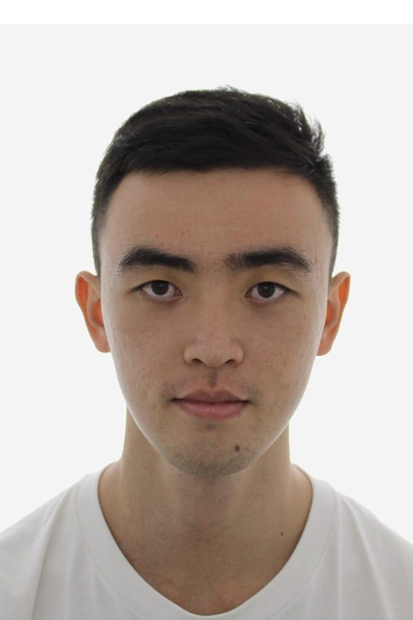

We are a team based in the [School of Computing, National University of Singapore](https://www.comp.nus.edu.sg).

You can reach us at the email `seer[at]comp.nus.edu.sg`

## Project team

### Jaeyoun Jeon

[[github](https://github.com/jaey0un)]
[[portfolio](team/jaeyoun.md)]

* Role: Developer
* Responsibilities: Storage

### Ng Shouhe

[[github](http://github.com/Yourface1746)]
[[portfolio](team/yourface1746)]

* Role: Developer
* Responsibilities: UI, Testing

### Thambad Samarth Shivanand

[[github](https://github.com/samthambad)]
[[portfolio](team/samthambad.md)]

* Role: Developer
* Responsibilities: Logic

### Ding Feng

[[github](http://github.com/dingf3ng)]
[[portfolio](team/dingfeng.md)]

* Role: Developer
* Responsibilities: UI

### Moey Sean Jean

[[github](https://github.com/moeyseanjean)]
[[portfolio](team/moeyseanjean.md)]

* Role: Developer
* Responsibilities: Model
