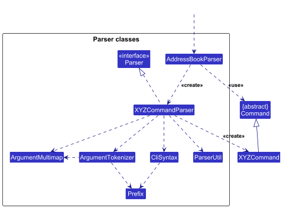
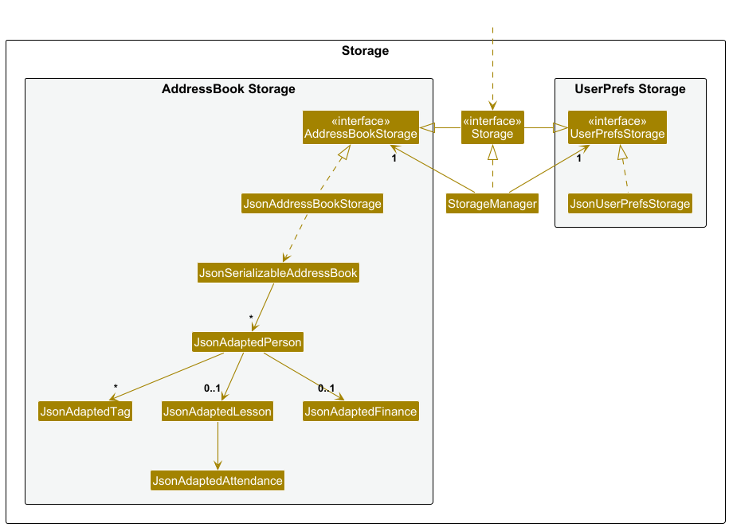

* Table of Contents
{:toc}

--------------------------------------------------------------------------------------------------------------------

## **Acknowledgements**

AI was used throughout the development of this project:
* GitHub Copilot was used for auto-completing code snippets.
* Claude Sonnet 4.5 was used to generate the unit tests.
* Claude Haiku 4.5 was used to review long documents and tool-use to ensure document consistency.
* This is a brownfield project based on the [AddressBook-Level3](https://se-education.org/addressbook-level3/) project developed by SE-EDU.

--------------------------------------------------------------------------------------------------------------------

## **Setting Up**

Refer to the guide [_Setting Up_](SettingUp.md).

--------------------------------------------------------------------------------------------------------------------

## **Design**

:bulb: **Tip:** The `.puml` files used to create diagrams are in this document `docs/diagrams` folder. Refer to the [_PlantUML Tutorial_ at se-edu/guides](https://se-education.org/guides/tutorials/plantUml.html) to learn how to create and edit diagrams.

### Architecture

The ***Architecture Diagram*** given above explains the high-level design of the App.

Given below is a quick overview of main components and how they interact with each other.

**Main components of the architecture**

**`Main`** (consisting of classes [`Main`](https://github.com/AY2526S1-CS2103T-T14-1/tp/blob/master/src/main/java/seedu/address/Main.java) and [`MainApp`](https://github.com/AY2526S1-CS2103T-T14-1/tp/blob/master/src/main/java/seedu/address/MainApp.java)) is in charge of the app launch and shut down.
* At app launch, it initializes the other components in the correct sequence, and connects them up with each other.
* At shut down, it shuts down the other components and invokes cleanup methods where necessary.

The bulk of the app's work is done by the following four components:

* [**`UI`**](#ui-component): The UI of the App.
* [**`Logic`**](#logic-component): The command executor.
* [**`Model`**](#model-component): Holds the data of the App in memory.
* [**`Storage`**](#storage-component): Reads data from, and writes data to, the hard disk.

[**`Commons`**](#common-classes) represents a collection of classes used by multiple other components.

**How the architecture components interact with each other**

The *Sequence Diagram* below shows how the components interact with each other for the scenario where the user issues the command `delete 1`.

Each of the four main components (also shown in the diagram above),

* defines its *API* in an `interface` with the same name as the Component.
* implements its functionality using a concrete `{Component Name}Manager` class (which follows the corresponding API `interface` mentioned in the previous point).

For example, the `Logic` component defines its API in the `Logic.java` interface and implements its functionality using the `LogicManager.java` class which follows the `Logic` interface. Other components interact with a given component through its interface rather than the concrete class (reason: to prevent outside component's being coupled to the implementation of a component), as illustrated in the (partial) class diagram below.

The sections below give more details of each component.

### UI Component

The **API** of this component is specified in [`Ui.java`](https://github.com/AY2526S1-CS2103T-T14-1/tp/blob/master/src/main/java/seedu/address/ui/Ui.java)

The UI consists of a `MainWindow` that is made up of parts e.g.`CommandBox`, `ResultDisplay`, `PersonListPanel`, `StatusBarFooter` etc. All these, including the `MainWindow`, inherit from the abstract `UiPart` class which captures the commonalities between classes that represent parts of the visible GUI.

The `UI` component uses the JavaFx UI framework. The layout of these UI parts are defined in matching `.fxml` files that are in the `src/main/resources/view` folder. For example, the layout of the [`MainWindow`](https://github.com/AY2526S1-CS2103T-T14-1/tp/blob/master/src/main/java/seedu/address/ui/MainWindow.java) is specified in [`MainWindow.fxml`](https://github.com/AY2526S1-CS2103T-T14-1/tp/blob/master/src/main/resources/view/MainWindow.fxml)

The `UI` component,

* executes user commands using the `Logic` component.
* listens for changes to `Model` data so that the UI can be updated with the modified data.
* keeps a reference to the `Logic` component, because the `UI` relies on the `Logic` to execute commands.
* depends on some classes in the `Model` component, as it displays `Person` object residing in the `Model`.

### Logic Component

**API** : [`Logic.java`](https://github.com/AY2526S1-CS2103T-T14-1/tp/blob/master/src/main/java/seedu/address/logic/Logic.java)

Here's a (partial) class diagram of the `Logic` component:

The sequence diagram below illustrates the interactions within the `Logic` component, taking `execute("delete 1")` API call as an example.

:information_source: **Note:** The lifeline for `DeleteCommandParser` should end at the destroy marker (X) but due to a limitation of PlantUML, the lifeline continues till the end of diagram.

How the `Logic` component works:

1. When `Logic` is called upon to execute a command, it is passed to an `AddressBookParser` object which in turn creates a parser that matches the command (e.g., `DeleteCommandParser`) and uses it to parse the command.
1. This results in a `Command` object (more precisely, an object of one of its subclasses e.g., `DeleteCommand`) which is executed by the `LogicManager`.
1. The command can communicate with the `Model` when it is executed (e.g. to delete a person). 
   Note that although this is shown as a single step in the diagram above (for simplicity), in the code it can take several interactions (between the command object and the `Model`) to achieve.
1. The result of the command execution is encapsulated as a `CommandResult` object which is returned back from `Logic`.

Here are the other classes in `Logic` (omitted from the class diagram above) that are used for parsing a user command:

How the parsing works:
* When called upon to parse a user command, the `AddressBookParser` class creates an `XYZCommandParser` (`XYZ` is a placeholder for the specific command name e.g., `AddCommandParser`) which uses the other classes shown above to parse the user command and create a `XYZCommand` object (e.g., `AddCommand`) which the `AddressBookParser` returns back as a `Command` object.
* All `XYZCommandParser` classes (e.g., `AddCommandParser`, `DeleteCommandParser`, ...) inherit from the `Parser` interface so that they can be treated similarly where possible e.g, during testing.

### Model Component
**API** : [`Model.java`](https://github.com/AY2526S1-CS2103T-T14-1/tp/blob/master/src/main/java/seedu/address/model/Model.java)

The `Model` component,

* stores the application data i.e., all `Person` objects (which are contained in a `UniquePersonList` object).
* stores the currently 'selected' `Person` objects (e.g., results of a search query) as a separate _filtered_ list which is exposed to outsiders as an unmodifiable `ObservableList<Person>` that can be 'observed' e.g. the UI can be bound to this list so that the UI automatically updates when the data in the list change.
* stores a `UserPref` object that represents the user's preferences. This is exposed to the outside as a `ReadOnlyUserPref` objects.
* does not depend on any of the other three components (as the `Model` represents data entities of the domain, they should make sense on their own without depending on other components)

**Field Validation Constraints**

Each `Person` object contains validated fields with the following constraints to prevent UI overflow and ensure data integrity:

| Field           | Validation Rules                                                                                    | Max Length            |
|-----------------|-----------------------------------------------------------------------------------------------------|-----------------------|
| `Name`          | Alphanumeric characters with `/`, `'`, `.`, `-` and spaces only. Cannot be blank.                   | 50 characters         |
| `Phone`         | Numeric digits only. Minimum 3 digits.                                                              | 20 digits             |
| `Email`         | Valid email format (local-part@domain).                                                             | 50 characters         |
| `Address`       | Alphanumeric characters with `/`, `#`, `-`, `.`, `,` and spaces only. Cannot be blank.              | -                     |
| `Tag`           | Alphanumeric characters only. Cannot be blank.                                                      | 15 characters per tag |
| `LessonName`    | Alphanumeric characters and spaces only. Cannot be blank.                                           | -                     |
| `Date`          | `Monday`, `Tuesday`, `Wednesday`, `Thursday`, `Friday`, `Saturaday` or `Sunday` (case-insensitive). | -                     |
| `Time`          | `hh:mm` format.                                                                                     | -                     |
| `Location`      | Alphanumeric characters and spaces only. Cannot be blank.                                           | -                     |
| `FinanceAmount` | Number up to 2 decimals between 0.00 and 1,000,000.00                                               | -                     |

These constraints are enforced at the model level in their respective classes through the `isValid*()` methods.

Note that:
- `Attendance` has no constraints as it is a class that is not edited by user directly.
- `PaymentEntry` has no constraints as it is a class with other validated classes as attributes.

:information_source: **Note:** An alternative (arguably, a more OOP) model is given below. It has a `Tag` list in the `AddressBook`, which `Person` references. This allows `AddressBook` to only require one `Tag` object per unique tag, instead of each `Person` needing their own `Tag` objects. 

### Storage Component

**API** : [`Storage.java`](https://github.com/AY2526S1-CS2103T-T14-1/tp/blob/master/src/main/java/seedu/address/storage/Storage.java)

The `Storage` component,
* can save both application data and user preference data in JSON format, and read them back into corresponding objects.
* inherits from both `AddressBookStorage` and `UserPrefStorage`, which means it can be treated as either one (if only the functionality of only one is needed).
* depends on some classes in the `Model` component (because the `Storage` component's job is to save/retrieve objects that belong to the `Model`)

### Common Classes

Classes used by multiple components are in the `seedu.address.commons` package.

--------------------------------------------------------------------------------------------------------------------

## **Supporting Documentation**

* [Documentation Guide](Documentation.md)
* [Testing Guide](Testing.md)
* [Logging Guide](Logging.md)
* [Configuration Guide](Configuration.md)
* [DevOps Guide](DevOps.md)

--------------------------------------------------------------------------------------------------------------------

## **Appendix: Requirements**

### Product Scope

**Target User Profile**:

* Needs to manage a large number of student contacts
* Prefers desktop applications over mobile/web
* Types quickly and efficiently
* Prefers keyboard input over mouse-driven interactions
* Comfortable using command-line style applications

**Value Proposition**:
Enable tutors and teachers to manage student contacts, lessons, and finances **faster and more efficiently** than traditional GUI-based apps.

### User Stories

Priorities: High (must have) - `* * *`, Medium (nice to have) - `* *`, Low (unlikely to have) - `*`

| Priority | As a …   | I want to …                                             | So that I can…                                                |
|----------|----------|---------------------------------------------------------|---------------------------------------------------------------|
| `* * *`  | tutor    | add a new student with details (name, contact, address) | manage them in the system                                     |
| `* * *`  | tutor    | view a student’s details                                | reach them easily                                             |
| `* * *`  | tutor    | delete a student permanently                            | reduce clutter                                                |
| `* * *`  | tutor    | search by student name                                  | quickly find their record                                     |
| `* * *`  | tutor    | search by tag                                           | quickly find their record                                     |
| `* * *`  | tutor    | add a lesson with date, time, and location              | track when and where I teach                                  |
| `* * *`  | tutor    | see a weekly schedule                                   | plan my teaching                                              |
| `* * *`  | tutor    | add outstanding tuition fees                            | track income                                                  |
| `* * *`  | tutor    | record fee payments                                     | know who has paid                                             |
| `* * *`  | tutor    | see outstanding payments                                | follow up with students/parents                               |
| `* * *`  | tutor    | resume usage after months away                          | pick up without losing my data                                |
| `* *`    | tutor    | edit student details                                    | keep their profile up-to-date                                 |
| `* *`    | tutor    | mark attendance for a lesson                            | know if the student showed up                                 |
| `* *`    | tutor    | export a financial report                               | manage my finances better                                     |
| `*`      | new user | see sample student data                                 | understand how the system works before adding my own students |
| `* `     | user     | purge all sample data                                   | start clean with my own student information                   |
| `*`      | tutor    | import student data                                     | save time entering existing records                           |
| `*`      | tutor    | create groups of students                               | manage group lessons                                          |

### Use Cases

(For all use cases below, the **System** is the `StudentConnect` and the **Actor** is the `user`, unless specified otherwise)

**UC1: Add New Student**

**MSS**

1. Actor chooses to add a new student.
2. Actor enters the details in format specified.
3. System adds the student and displays a success message.

    Use case ends.

**Extensions**

* 2a. System detects missing or invalid details.

    * 2a1. System requests correct details.

      Use case resumes at step 2.

* *a. At any time, Actor cancels the operation.

    Use case ends.

**UC2: Edit Student**

**MSS**

1. Actor chooses to edit a student.
2. Actor enters the details in format specified.
3. System saves the details and displays a success message.

   Use case ends.

**Extensions**

* 2a. System detects missing or invalid details.

    * 2a1. System requests correct details.

      Use case resumes at step 2.

* *a. At any time, Actor cancels the operation.

  Use case ends.

**UC3: Search Student By Name**

**MSS**

1. Actor chooses to search a student by name.
2. Actor enters the details in format specified.
3. System searches for matching student records.
4. System displays results.

   Use case ends.

**Extensions**

* 3a. No matching student found.

    * 3a1. System displays empty list.

      Use case ends.

* *a. At any time, Actor cancels the operation.

  Use case ends.

**UC4: Search Student By Tag**

**MSS**

1. Actor chooses to search a student by tag.
2. Actor enters the details in format specified.
3. System searches for matching student records.
4. System displays results.

   Use case ends.

**Extensions**

* 3a. No matching student found.

    * 3a1. System displays empty list.

      Use case ends.

* *a. At any time, Actor cancels the operation.

  Use case ends.

**UC5: Delete Student**

**MSS**

1. Actor chooses to delete a student.
2. Actor enters the details in format specified.
3. System deletes the student and displays a success message.

    Use case ends.

**Extensions**

* 2a. System detects missing or invalid details.

    * 2a1. System requests correct details.

      Use case resumes at step 2.

* *a. At any time, Actor cancels the operation.

  Use case ends.

**UC6: List Students**

**MSS**

1. Actor chooses to list all students.
2. System lists the students and displays a success message.

   Use case ends.

**Extensions**

* 1a. System has no students.

    * 1a1. System displays "List is empty".

      Use case ends.

* *a. At any time, Actor cancels the operation.

  Use case ends.

**UC7: Clear Students**

**MSS**

1. Actor chooses to clear all students.
2. System clears the students and displays a success message.

   Use case ends.

**Extensions**

* *a. At any time, Actor cancels the operation.

  Use case ends.

**UC8: Add Lesson**

**MSS**

1. Actor chooses to add a new lesson.
2. Actor enters the details in format specified.
3. System adds the lesson and displays a success message.

    Use case ends.

**Extensions**

* 2a. System detects invalid/missing details.

    * 2a1. System requests correction.

      Use case resumes at step 2.

* *a. At any time, Actor cancels the operation.

  Use case ends.

**UC9: Mark Attendance**

**MSS**

1. Actor chooses to mark attendance.
2. Actor enters the details in format specified.
3. System saves attendance record and displays a success message.

    Use case ends.

**Extensions**

* 2a. System detects invalid/missing details.

    * 2a1. System requests correction.

      Use case resumes at step 2.

* *a. At any time, Actor cancels the operation.

  Use case ends.

**UC10: View Schedule**

**MSS**

1. Actor chooses to view schedule.
2. System displays weekly schedule of lessons and a success message.

   Use case ends.

**Extensions**

* 1a. No lessons scheduled.

    * 1a1. System displays “NO LESSONS FOUND THIS WEEK!”

      Use case ends.

* *a. At any time, Actor cancels the operation.

  Use case ends.

**UC11: Add Tuition Fee**

**MSS**

1. Actor chooses to add tuition fee.
2. Actor enters the details in format specified.
3. System saves fee record and displays a success message.

    Use case ends.

**Extensions**

* 2a. System detects invalid/missing details.

    * 2a1. System requests correction.

      Use case resumes at step 2.

* *a. At any time, Actor cancels the operation.

  Use case ends.

**UC12: Record Fee Payment**

**MSS**

1. Actor chooses to record fee payment.
2. Actor enters the details in format specified.
3. System records payment and displays a success message.

    Use case ends.

**Extensions**

* 2a. Payment is made for student who does not owe any fee.

    * 2a1. System displays error, showing that selected student does not owe any fee.

      Use case ends.

* 2b. System detects invalid/missing details.

    * 2b1. System requests correction.

      Use case resumes at step 2.

* *a. At any time, Actor cancels the operation.

  Use case ends.

**UC13: View Payment History**

**MSS**

1. Actor chooses to view all recorded payments.
2. System gets payment entries from all students.
3. System sorts the payments by date, newest first.
4. System displays the payment history and displays a success message.

Use case ends.

**Extensions**

* 2a. No Payment record exist.

    * 2a1. System displays “No payments records found.”

      Use case ends.

* 2b. Some entries are linked to students that were deleted or corrupted.

    * 2b1. System skips those invalid entries (no warning is shown).

      Use case resumes at step 3.

* *a. At any time, Actor cancels the operation.

  Use case ends.

**UC14: View Outstanding Payments**

**MSS**

1. Actor chooses to view outstanding payments.
2. System displays a list of unpaid fees by student and a success message.

    Use case ends.

**Extensions**

* 1a. No outstanding payments.

    * 1a1. System displays “No outstanding payments found.”

      Use case ends.

* *a. At any time, Actor cancels the operation.

  Use case ends.

### Non-Functional Requirements

1. Should work on any mainstream OS as long as it has Java 17 installed.
2. Should be able to hold up to 1000 persons with < 100 ms response time for typical usage.
3. Should be faster to execute commands using keyboard than using mouse.
4. Should have learnability time of under 5 minutes for new users.
5. Should have graceful handling of failures.
6. Should have backend logs for quick debugging.
7. Should have local storage of data.
8. Should have human editable data.
9. Should be packaged into a single JAR file.

### Glossary

* **Mainstream OS**: Windows, Linux, Unix, MacOS
* **Private Contact Detail**: A contact detail that is not meant to be shared with others
* **Student**: A person receiving tuition from the tutor
* **Tutor**: A person giving tuition
* **Tag**: An identifier given to student
* **Lesson**: A scheduled teaching session between tutor and student
* **Attendance**: Record of whether a student was present or absent for a lesson
* **Schedule**: Timetable of lessons
* **Outstanding Fee**: Tuition fee owed by a student that are not yet paid
* **Payment**: A record of transaction from student to tutor
* **Payment History**: Record of all past transactions

--------------------------------------------------------------------------------------------------------------------

## **Appendix: Manual Testing**

Given below are instructions to test the app manually.

:information_source: **Note:** These instructions only provide a starting point for testers to work on;
testers are expected to do more *exploratory* testing.

### Launch

1. Initial launch

   1. Download the jar file and copy into an empty folder.

   2. Double-click the jar file. 
      Expected: Shows the GUI with a set of sample contacts. The window size may not be optimum.

2. Saving window preferences

   1. Resize the window to an optimum size. Move the window to a different location. Close the window.

   2. Re-launch the app by double-clicking the jar file. 
       Expected: The most recent window size and location is retained.

### Adding Student

1. Adding a student

    1. Test case: `add n/John Doe p/98765432 e/johnd@example.com addr/John street, block 123, #01-01` 
       Expected: Student is added to the list.

    2. Test case: `add n/Bob Dylan p/99765432 e/bobd@example.com addr/Bo street, block 13, #01-31 tag/friend` 
       Expected: Student is added to the list with a tag.

    3. Test case: `add n/Bob Dylan p/99765432 e/bobd@example.com` 
       Expected: No student is added. Error details shown in the status message. Status bar remains the same.

    4. Test case: `add n/Bob Dylan p/99765432 e/bobd@example.com addr/` 
       Expected: No student is added. Error details shown in the status message. Status bar remains the same.

    5. Test case: `add` 
       Expected: No student is added. Error details shown in the status message. Status bar remains the same.

### Editing Student

1. Editing a student while all students are being shown

    1. Prerequisites: List all students using the `list` command. Multiple students in the list.

    2. Test case: `edit 1 n/John Doe` 
       Expected: 1st displayed student's name is changed to `John Doe`.

    3. Test case: `edit 1 tag/` 
       Expected: 1st displayed student's tags are removed.

    4. Test case: `edit 1 n/` 
       Expected: No student is edited. Error details shown in the status message. Status bar remains the same.

    5. Test case: `edit -1 n/John Doe` 
       Expected: No student is edited. Error details shown in the status message. Status bar remains the same.

    6. Test case: `edit 1` 
       Expected: No student is edited. Error details shown in the status message. Status bar remains the same.

    7. Test case: `edit n/John Doe` 
       Expected: No student is edited. Error details shown in the status message. Status bar remains the same.

    8. Test case: `edit` 
       Expected: No student is edited. Error details shown in the status message. Status bar remains the same.

2. Editing a student while some students are being shown

    1. Prerequisites: List some students using the `findname` command. Multiple students in the list.

    2. Test case: `edit 1 n/John Doe` 
       Expected: 1st displayed student's name is changed to `John Doe`.

    3. Test case: `edit 1 tag/` 
       Expected: 1st displayed student's tags are removed.

    4. Test case: `edit 1 n/` 
       Expected: No student is edited. Error details shown in the status message. Status bar remains the same.

    5. Test case: `edit -1 n/JohnDoe` 
       Expected: No student is edited. Error details shown in the status message. Status bar remains the same.

    6. Test case: `edit 1` 
       Expected: No student is edited. Error details shown in the status message. Status bar remains the same.

    7. Test case: `edit n/John Doe` 
       Expected: No student is edited. Error details shown in the status message. Status bar remains the same.

    8. Test case: `edit` 
       Expected: No student is edited. Error details shown in the status message. Status bar remains the same.

### Finding Students By Name

1. Finding a student by name

    1. Prerequisites: List all students using the `list` command. Multiple students with names `David` and `Alex` in the list.

    2. Test case: `findname David` 
       Expected: All students whose names matching `David` are displayed.

    3. Test case: `findname David Alex` 
       Expected: All students whose names matching `David` or `Alex` are displayed.

    4. Test case: `findname` 
       Expected: Error details shown in the status message. Status bar remains the same.

### Finding Students By Tag

1. Finding a student by tag

    1. Prerequisites: List all students using the `list` command. Multiple students with `Physics` and `Math` tags in the list.

    2. Test case: `findtag Physics` 
       Expected: All students whose tags matching `Physics` are displayed.

    3. Test case: `findtag Physics Math` 
       Expected: All students whose tags matching `Physics` or `Math` are displayed.

    4. Test case: `findtag` 
       Expected: Error details shown in the status message. Status bar remains the same.

### Deleting Student

1. Deleting a student while all students are being shown

   1. Prerequisites: List all students using the `list` command. Multiple students in the list.

   2. Test case: `delete 1` 
      Expected: First displayed contact is deleted from the list. Details of the deleted contact shown in the status message.

   3. Test case: `delete 0` 
      Expected: No student is deleted. Error details shown in the status message. Status bar remains the same.

   4. Test case: `delete` 
      Expected: No student is deleted. Error details shown in the status message. Status bar remains the same.

2. Deleting a student while some students are being shown

    1. Prerequisites: List some students using the `findname` command. Multiple students in the list.

    2. Test case: `delete 1` 
       Expected: First displayed contact is deleted from the list. Details of the deleted contact shown in the status message.

    3. Test case: `delete 0` 
       Expected: No student is deleted. Error details shown in the status message. Status bar remains the same.

    4. Test case: `delete` 
       Expected: No student is deleted. Error details shown in the status message. Status bar remains the same.

### Listing All Students

1. Listing all students

    1. Prerequisites: Multiple students in the list.

    2. Test case: `list` 
       Expected: All students are listed.

### Clearing All Students

1. Clearing all students

    1. Prerequisites: Multiple students in the list.

    2. Test case: `clear` 
       Expected: All students are cleared.

### Adding Lesson

1. Adding a lesson while all students are being shown

    1. Prerequisites: List all students using the `list` command. Multiple students in the list.

    2. Test case: `addlesson 1 n/Math d/Monday t/12:00 loc/RoomA` 
       Expected: A lesson with name `Math` on `Monday` `12:00` at `RoomA` is added to the first displayed contact.

    3. Test case: `addlesson 1 n/Math d/Monday t/12:00` 
       Expected: No lesson is added. Error details shown in the status message. Status bar remains the same.

    4. Test case: `addlesson 1 n/ d/Monday t/12:00 loc/RoomA` 
       Expected: No lesson is added. Error details shown in the status message. Status bar remains the same.

    5. Test case: `addlesson -1 n/Math d/Monday t/12:00 loc/RoomA` 
       Expected: No lesson is added. Error details shown in the status message. Status bar remains the same.

    6. Test case: `addlesson 1` 
       Expected: No lesson is added. Error details shown in the status message. Status bar remains the same.

    7. Test case: `addlesson n/Math d/Monday t/12:00 loc/RoomA` 
       Expected: No lesson is added. Error details shown in the status message. Status bar remains the same.

    8. Test case: `addlesson` 
       Expected: No lesson is added. Error details shown in the status message. Status bar remains the same.

2. Adding a lesson while some students are being shown

    1. Prerequisites: List some students using the `findname` command. Multiple students in the list.

    2. Test case: `addlesson 1 n/Math d/Monday t/12:00 loc/RoomA` 
       Expected: A lesson with name `Math` on `Monday` `12:00` at `RoomA` is added to the first displayed contact.

    3. Test case: `addlesson 1 n/Math d/Monday t/12:00` 
       Expected: No lesson is added. Error details shown in the status message. Status bar remains the same.

    4. Test case: `addlesson 1 n/ d/Monday t/12:00 loc/RoomA` 
       Expected: No lesson is added. Error details shown in the status message. Status bar remains the same.

    5. Test case: `addlesson -1 n/Math d/Monday t/12:00 loc/RoomA` 
       Expected: No lesson is added. Error details shown in the status message. Status bar remains the same.

    6. Test case: `addlesson 1` 
       Expected: No lesson is added. Error details shown in the status message. Status bar remains the same.

    7. Test case: `addlesson n/Math d/Monday t/12:00 loc/RoomA` 
       Expected: No lesson is added. Error details shown in the status message. Status bar remains the same.

    8. Test case: `addlesson` 
       Expected: No lesson is added. Error details shown in the status message. Status bar remains the same.

### Marking Attendance

1. Marking an attendance while all students are being shown

    1. Prerequisites: List all students using the `list` command. Multiple students in the list.

    2. Test case: `mark 1 s/present` 
       Expected: Marks the first displayed contact as present.

    3. Test case: `mark 1 s/late` 
       Expected: No attendance is marked. Error details shown in the status message. Status bar remains the same.

    4. Test case: `mark 1 s/` 
       Expected: No attendance is marked. Error details shown in the status message. Status bar remains the same.

    5. Test case: `mark -1 s/present` 
       Expected: No attendance is marked. Error details shown in the status message. Status bar remains the same.

    6. Test case: `mark 1` 
       Expected: No attendance is marked. Error details shown in the status message. Status bar remains the same.

    7. Test case: `mark s/present` 
       Expected: No attendance is marked. Error details shown in the status message. Status bar remains the same.

    8. Test case: `mark` 
       Expected: No attendance is marked. Error details shown in the status message. Status bar remains the same.

2. Marking an attendance while some students are being shown

    1. Prerequisites: List some students using the `findname` command. Multiple students in the list.

    2. Test case: `mark 1 s/present` 
       Expected: Marks the first displayed contact as present.

    3. Test case: `mark 1 s/late` 
       Expected: No attendance is marked. Error details shown in the status message. Status bar remains the same.

    4. Test case: `mark 1 s/` 
       Expected: No attendance is marked. Error details shown in the status message. Status bar remains the same.

    5. Test case: `mark -1 s/present` 
       Expected: No attendance is marked. Error details shown in the status message. Status bar remains the same.

    6. Test case: `mark 1` 
       Expected: No attendance is marked. Error details shown in the status message. Status bar remains the same.

    7. Test case: `mark s/present` 
       Expected: No attendance is marked. Error details shown in the status message. Status bar remains the same.

    8. Test case: `mark` 
       Expected: No attendance is marked. Error details shown in the status message. Status bar remains the same.

### Viewing Weekly Schedule

1. Viewing weekly schedule

    1. Prerequisites: There are some lessons for some students.

    2. Test case: `schedule` 
       Expected: A popup window with the schedule is shown.

### Adding Outstanding Fee

1. Adding an outstanding fee while all students are being shown

    1. Prerequisites: List all students using the `list` command. Multiple students in the list.

    2. Test case: `addfee 1 amt/100` 
       Expected: Adds fee of $100 to the first displayed contact.

    3. Test case: `addfee 1 amt/-100` 
       Expected: No fee is added. Error details shown in the status message. Status bar remains the same.

    4. Test case: `addfee 1 amt/` 
       Expected: No fee is added. Error details shown in the status message. Status bar remains the same.

    5. Test case: `addfee -1 amt/100` 
       Expected: No fee is added. Error details shown in the status message. Status bar remains the same.

    6. Test case: `addfee 1` 
       Expected: No fee is added. Error details shown in the status message. Status bar remains the same.

    7. Test case: `addfee amt/100` 
       Expected: No fee is added. Error details shown in the status message. Status bar remains the same.

    8. Test case: `addfee` 
       Expected: No fee is added. Error details shown in the status message. Status bar remains the same.

2. Adding an outstanding fee while some students are being shown

    1. Prerequisites: List some students using the `findname` command. Multiple students in the list.

    2. Test case: `addfee 1 amt/100` 
       Expected: Adds fee of $100 to the first displayed contact.

    3. Test case: `addfee 1 amt/-100` 
       Expected: No fee is added. Error details shown in the status message. Status bar remains the same.

    4. Test case: `addfee 1 amt/` 
       Expected: No fee is added. Error details shown in the status message. Status bar remains the same.

    5. Test case: `addfee -1 amt/100` 
       Expected: No fee is added. Error details shown in the status message. Status bar remains the same.

    6. Test case: `addfee 1` 
       Expected: No fee is added. Error details shown in the status message. Status bar remains the same.

    7. Test case: `addfee amt/100` 
       Expected: No fee is added. Error details shown in the status message. Status bar remains the same.

    8. Test case: `addfee` 
       Expected: No fee is added. Error details shown in the status message. Status bar remains the same.

### Adding Payment

1. Recording a payment made while all students are being shown

    1. Prerequisites: List all students using the `list` command. Multiple students in the list.

    2. Test case: `pay 1 amt/100` 
       Expected: Deducts $100 from the first displayed contact's owed amount.

    3. Test case: `pay 1 amt/-100` 
       Expected: No payment is recorded. Error details shown in the status message. Status bar remains the same.

    4. Test case: `pay 1 amt/` 
       Expected: No payment is recorded. Error details shown in the status message. Status bar remains the same.

    5. Test case: `pay -1 amt/100` 
       Expected: No payment is recorded. Error details shown in the status message. Status bar remains the same.

    6. Test case: `pay 1` 
       Expected: No payment is recorded. Error details shown in the status message. Status bar remains the same.

    7. Test case: `pay amt/100` 
       Expected: No payment is recorded. Error details shown in the status message. Status bar remains the same.

    8. Test case: `pay` 
       Expected: No payment is recorded. Error details shown in the status message. Status bar remains the same.

2. Recording a payment made while some students are being shown

    1. Prerequisites: List some students using the `findname` command. Multiple students in the list.

    2. Test case: `pay 1 amt/100` 
       Expected: Deducts $100 from the first displayed contact's owed amount.

    3. Test case: `pay 1 amt/-100` 
       Expected: No payment is recorded. Error details shown in the status message. Status bar remains the same.

    4. Test case: `pay 1 amt/` 
       Expected: No payment is recorded. Error details shown in the status message. Status bar remains the same.

    5. Test case: `pay -1 amt/100` 
       Expected: No payment is recorded. Error details shown in the status message. Status bar remains the same.

    6. Test case: `pay 1` 
       Expected: No payment is recorded. Error details shown in the status message. Status bar remains the same.

    7. Test case: `pay amt/100` 
       Expected: No payment is recorded. Error details shown in the status message. Status bar remains the same.

    8. Test case: `pay` 
       Expected: No payment is recorded. Error details shown in the status message. Status bar remains the same.

### Viewing Payment History

1. Viewing payment history

    1. Prerequisites: There are some recorded payments for some students.

    2. Test case: `payments` 
       Expected: A popup window with the payment history is shown.

### Viewing Outstanding Payments

1. Viewing outstanding payments

    1. Prerequisites: There are some outstanding payments for some students.

    2. Test case: `outstanding` 
       Expected: A popup window with the outstanding payments is shown.

### Saving Data

1. Relaunch the app

    1. Prerequisites: Multiple students in the list.

    2. Relaunch the app. 
       Expected: The students remains in the list.

### Importing Data File

1. Import the list of students

    1. Prerequisites: A `.json` file in StudentConnect format.

    2. Go to `File->Import`. 
       Expected: The students in the selected `.json` file are imported into StudentConnect.

### Exporting Data File

1. Export the list of students

    1. Prerequisites: Multiple students in the list.

    2. Go to `File->Export`. 
       Expected: A `.json` file containing all the students is exported to the destination selected.

### Editing Data File

1. Corrupted data

    1. Prerequisites: The data file contains corrupted entries.

    2. Launch the app. 
       Expected: The students that are corrupted are skipped and the others are loaded.

### Exiting

1. Exiting the program

    1. Test case: `exit` 
       Expected: The program closes and exits.

    2. Test case: `File->Exit` 
       Expected: The program closes and exits.

    3. Test case: `X` button 
       Expected: The program closes and exits.

--------------------------------------------------------------------------------------------------------------------

## **Appendix: Planned Enhancements**

1. Handling of index larger than 2,147,483,647 but smaller than the size of the list.
2. Specific error message with missing required prefix.
