**Welcome to _StudentConnect_!**

**StudentConnect** is an easy-to-use app that **helps private tutors keep track of their students, lessons, attendance
and payments**. It’s designed to help you work faster and stay organized. You simply type short
commands, and your information appears neatly on the screen.

**_Don’t worry if you’re not good with computers!_** StudentConnect includes clear, step-by-step instructions to guide
you from installing the program to getting started. You’ll be up and running in just a few minutes.

For **new users**, start with the [_**Quick Start**_](#quick-start) section to learn how to install and launch the app.
Then, explore the [_**Features**_](#features) section to discover what you can do. Each command is explained with
examples so you can easily follow along.

For **experienced users**, check out the [_**Command Summary**_](#command-summary) to quickly look up any command
format.

For **troubleshooting or common questions**, check out the [_**FAQ**_](#faq) and [_**Known Issues**_](#known-issues)
sections at the end.

You can jump to any section using the **Table of Contents** below.

* Table of Contents
{:toc}

--------------------------------------------------------------------------------------------------------------------

# Quick start

## Installation

1. **Check your computer’s setup**<br>
   Make sure you have Java 17 or a newer version installed.<br>
   **Non-Mac users:** Download and install Java 17 [here](https://www.oracle.com/java/technologies/javase/jdk17-archive-downloads.html).<br>
   **Mac users:** Follow the instructions [here](https://se-education.org/guides/tutorials/javaInstallationMac.html).<br>
<br>
2. **Download StudentConnect**<br>Get the latest version of the app by downloading the `.jar` file from [here](https://github.com/AY2526S1-CS2103T-T14-1/tp/releases).<br>
<br>
3. **Choose where to save it**<br>Move the downloaded file to a folder where you want to keep your StudentConnect files.
   _(This will be your “home folder” for the app.)_<br>
<br>
4. **Open the app**<br>
   * Open the Command Prompt (Windows) or Terminal (Mac).
   * Go to the folder where you saved the file by typing:
        ```bash
        cd path_to_your_folder
        ```
   * Then run this command:
        ```bash
        java -jar studentconnect.jar
        ```
   * The app will open in a few seconds and show some sample data so you can try it out.

> 💡 **Tip:**<br>
> Start by typing `help` and pressing Enter to see this guide anytime you need help!

## Command Format

Before using the commands in StudentConnect, it helps to understand how they are written.
Here are a few simple rules to guide you:

### Basic Command Usage

* Type in **lowercase letters**
* Press **Enter** after typing
* Some commands need extra info (like a name or number)

### Understanding Command Format

* **Words in UPPER_CASE** are the parameters to be replaced.<br>
e.g. in `add n/NAME`, replace `NAME` with `John Doe`.<br>
<br>
* **Items in square brackets** are optional.<br>
e.g. `n/NAME [t/TAG]` can be used as `n/John Doe t/friend` or as `n/John Doe`.<br>
<br>
* **Items with `…`** after them can be used multiple times (including zero times).<br>
e.g. `[t/TAG]…` can be used as `t/friend`, `t/friend t/family` or not used at all.<br>
<br>
* **Parameters can be in any order.**<br>
e.g. `n/NAME p/PHONE_NUMBER` is the same as `p/PHONE_NUMBER n/NAME`.<br>
<br>
* **Extra parameters are ignored** for simple commands like `help`, `list`, `exit` and `clear`.<br>
e.g. `help 123` will be interpreted as `help`.<br>

> 💡 **Tip:**<br>
> If you are using a PDF version of this document, be careful when copying and pasting commands that span multiple lines
> as space characters surrounding line-breaks may be omitted when copied over to the application.

## User Interface Overview

The interface is designed to be intuitive and efficient for managing your students, lessons, attendance and payments.

### Main Interface

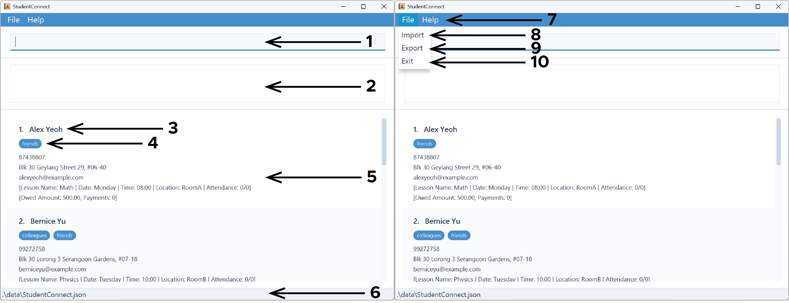

| #  | Description         |
|----|---------------------|
| 1  | Command Box         |
| 2  | Command Result      |
| 3  | Student Name        |
| 4  | Student Tags        |
| 5  | Student Details     |
| 6  | Data Directory      |
| 7  | Help (User Guide)   |
| 8  | Import Student List |
| 9  | Export Student List |
| 10 | Exit StudentConnect |

> 💡 **Tip:**<br>
> Scroll through long lists using the scroll bars.

### Key Features

* **Real-Time Updates**: Contact and event lists refresh instantly after any changes.
* **Sample Data Included**: The app comes preloaded with sample contacts and events to help you get started quickly.
* **Responsive Design**: The interface adapts seamlessly to different screen sizes and remains smooth even with hundreds
of contacts and events.
* **Clear Visual Feedback**: Every action provides immediate success or error messages for better user guidance.

--------------------------------------------------------------------------------------------------------------------

# Features

## Managing Students

### Adding student : `add`

**Adds a student** to StudentConnect.

**Format:**
```
add n/NAME p/PHONE_NUMBER e/EMAIL addr/ADDRESS [tag/TAG]…
```

> 💡 **Tip:**
> * `NAME`: Alphanumeric characters  with `/`, `'`, `.`, `-` and spaces only. Maximum 50 characters.
> * `PHONE_NUMBER`: Numbers only, at least 3 digits. Maximum 20 digits.
> * `EMAIL`: Valid email format. Maximum 50 characters.
> * `ADDRESS`: Can be any alphanumeric value with `/`, `#`, `-`, `.` and `,`.
> * `TAG`: Alphanumeric characters only. Maximum 15 characters per tag.

Example:
```
add n/John Doe p/98765432 e/johnd@example.com addr/John street, block 123, #01-01
```
<figure>
  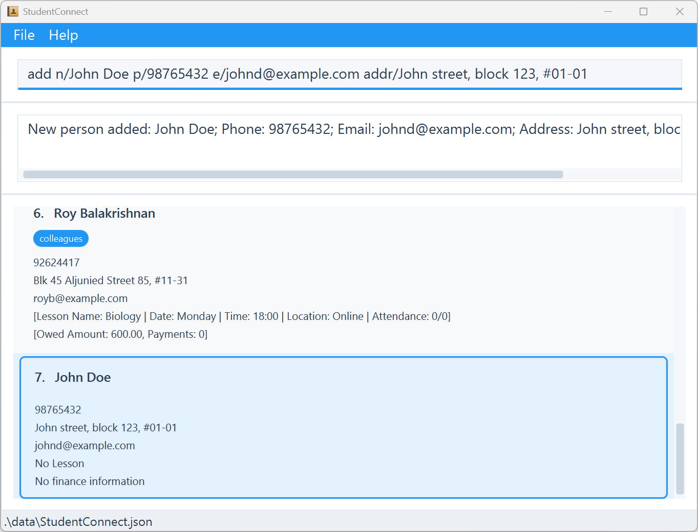
  <figcaption><em>Adds a student with name <code>John Doe</code>, phone <code>98765432</code>, email
    <code>johnd@example.com</code> and address <code>John street, block 123, #01-01</code></em></figcaption>
</figure>

### Editing student : `edit`

**Edits an existing student** in StudentConnect.

Format:
```
edit INDEX [n/NAME] [p/PHONE] [e/EMAIL] [addr/ADDRESS] [tag/TAG]…
```

> 💡 **Tip:**
> * `INDEX`: Refers to the index number shown in the displayed student list (1, 2, 3, …).
> * At least one of the optional fields must be provided.
> * Existing values will be updated to the input values.
> * When editing tags, the existing tags of the student will be overwritten.
> * To remove all the student’s tags, type `tag/` without specifying any tags after it.

Example:
```
edit 1 p/91234567 e/johndoe@example.com
```
<figure>
  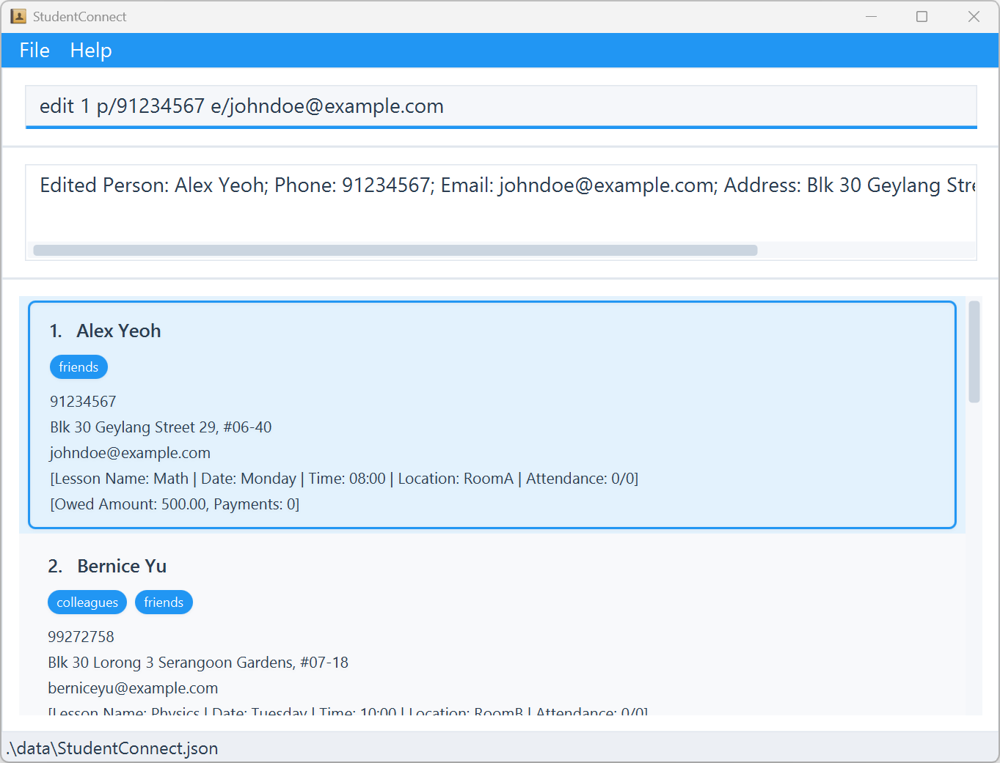
  <figcaption><em>Edits the phone number and email address of the 1st person to be <code>91234567</code> and
    <code>johndoe@example.com</code> respectively</em></figcaption>
</figure>

### Finding students by name : `find`

**Finds existing students by name** in StudentConnect.

Format:
```
find KEYWORD [MORE_KEYWORDS]...
```

> 💡 **Tip:**
> * The search is case-insensitive.
> * The order of the keywords does not matter.
> * Only the name is searched.
> * Only full words will be matched.
> * Students matching at least one keyword will be returned (i.e. `OR` search).

Example:
```
find alex david
```
<figure>
  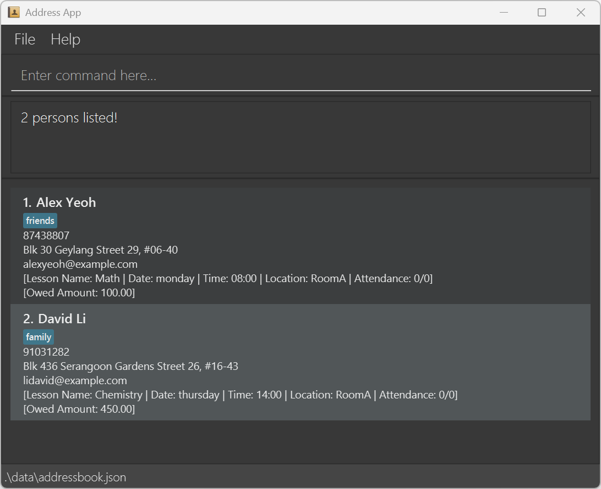
  <figcaption><em>Finds students whose names match either <code>alex</code> or <code>david</code></em></figcaption>
</figure>

### Finding students by tag : `findtag`

**Finds existing students by tag** in StudentConnect.

Format:
```
findtag TAG_NAME [MORE_TAGNAMES]...
```

> 💡 **Tip:**
> * The search is case-insensitive.
> * The order of the keywords does not matter.
> * Only the tag is searched.
> * Partial words will be matched.
> * Students matching at least one keyword will be returned (i.e. `OR` search).
 
Example:
```
findtag friends
```
<figure>
  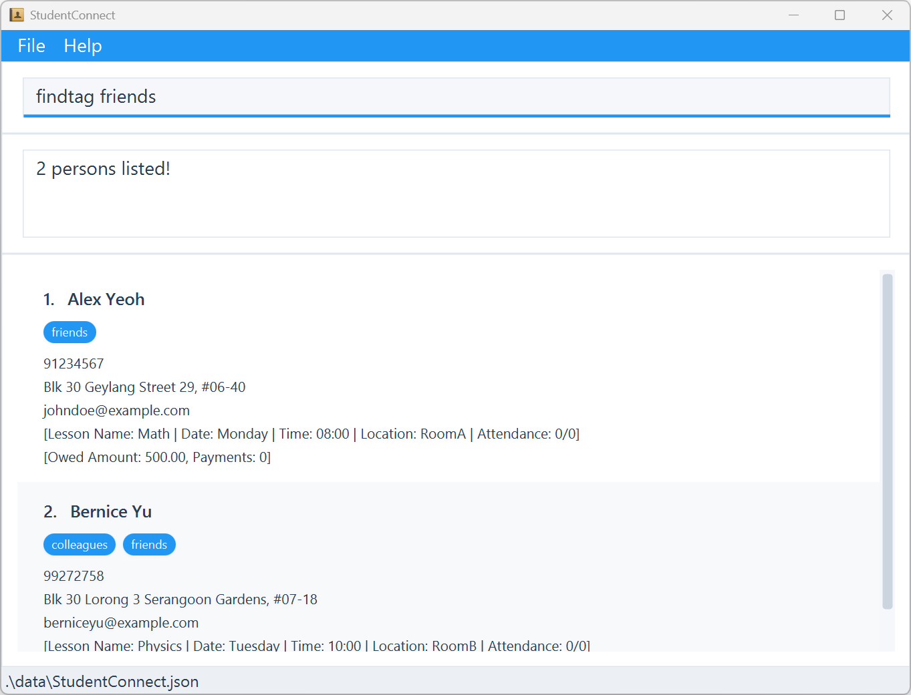
  <figcaption><em>Finds students whose tags partially match <code>friends</code></em></figcaption>
</figure>

### Deleting student : `delete`

**Deletes an existing student** in StudentConnect.

Format:
```
delete INDEX
```

> 💡 **Tip:**
> * `INDEX`: Refers to the index number shown in the displayed student list (1, 2, 3, …).

Example:
```
delete 1
```
<figure>
  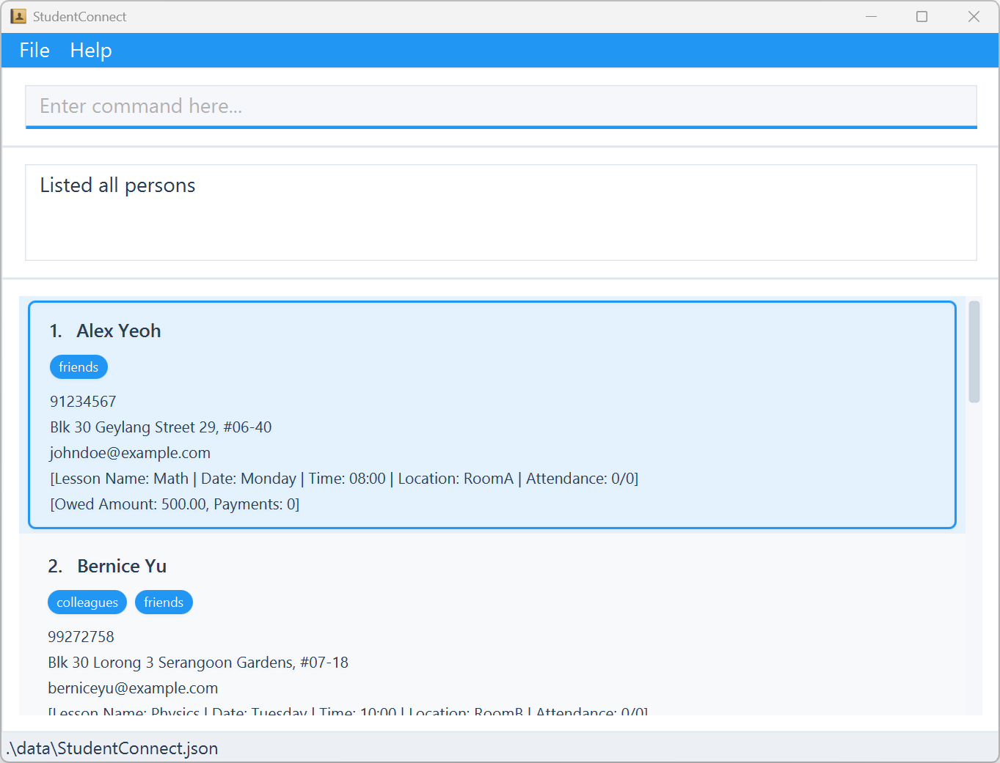
  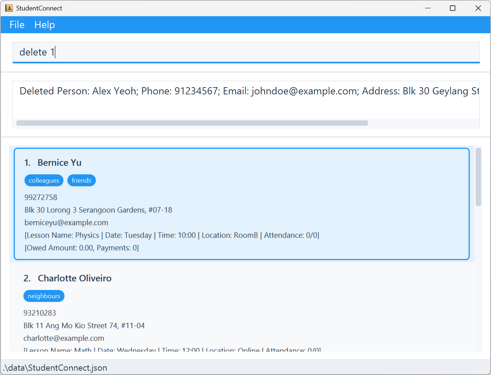
  <figcaption><em>Deletes the 1st person in the displayed student list</em></figcaption>
</figure>

### Listing all students : `list`

**List all students** in StudentConnect.

Format:
```
list
```

Example:
```
list
```
<figure>
  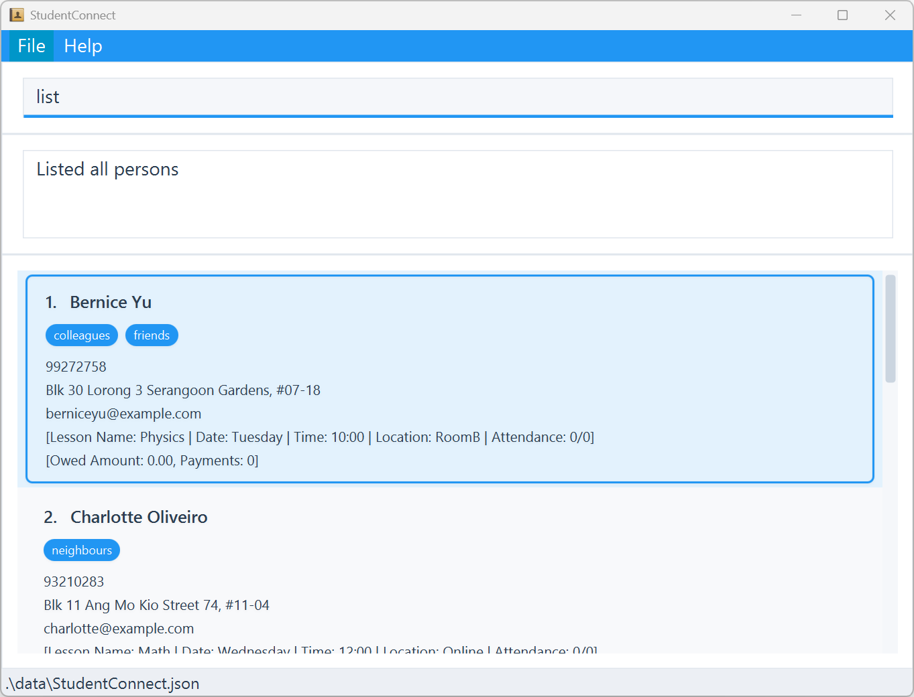
  <figcaption><em>Lists all students</em></figcaption>
</figure>

### Clearing all students : `clear`

**Clears all students** in StudentConnect.

Format:
```
clear
```

Example:
```
clear
```
<figure>
  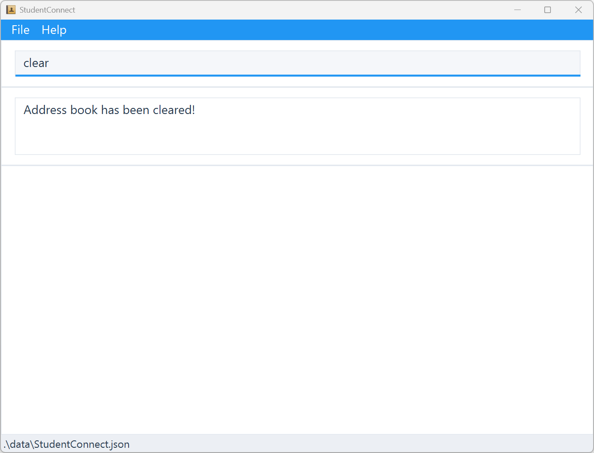
  <figcaption><em>Clears all entries</em></figcaption>
</figure>

## Managing Lessons

### Adding lesson : `addlesson`

**Adds a lesson** to a student in StudentConnect.

Format:
```
addlesson INDEX n/NAME d/DAY t/TIME loc/LOCATION
```

> 💡 **Tip:**
> * `INDEX`: Refers to the index number shown in the displayed student list (1, 2, 3, …).
> * `NAME`: Alphanumeric characters only.
> * `DAY`: `Monday`, `Tuesday`, `Wednesday`, `Thursday`, `Friday`, `Saturday` or `Sunday` (case-insensitive).
> * `TIME`: In **hh:mm** format.
> * `LOCATION`: Alphanumeric characters only.

Example:
```
addlesson 1 n/Math d/Monday t/12:00 loc/RoomA
```
<figure>
  
  <figcaption><em>Adds a lesson with name <code>Math</code> on <code>Monday</code> <code>12:00</code> at
    <code>RoomA</code> to the 1st person in the displayed student list</em></figcaption>
</figure>

### Marking attendance : `mark`

**Marks the attendance** for a student in StudentConnect.

Format:
```
mark INDEX s/STATUS
```

> 💡 **Tip:**
> * `INDEX`: Refers to the index number shown in the displayed student list (1, 2, 3, …).
> * `STATUS`: `present` or `absent` (case-insensitive).

Example:
```
mark 1 s/present
```
<figure>
  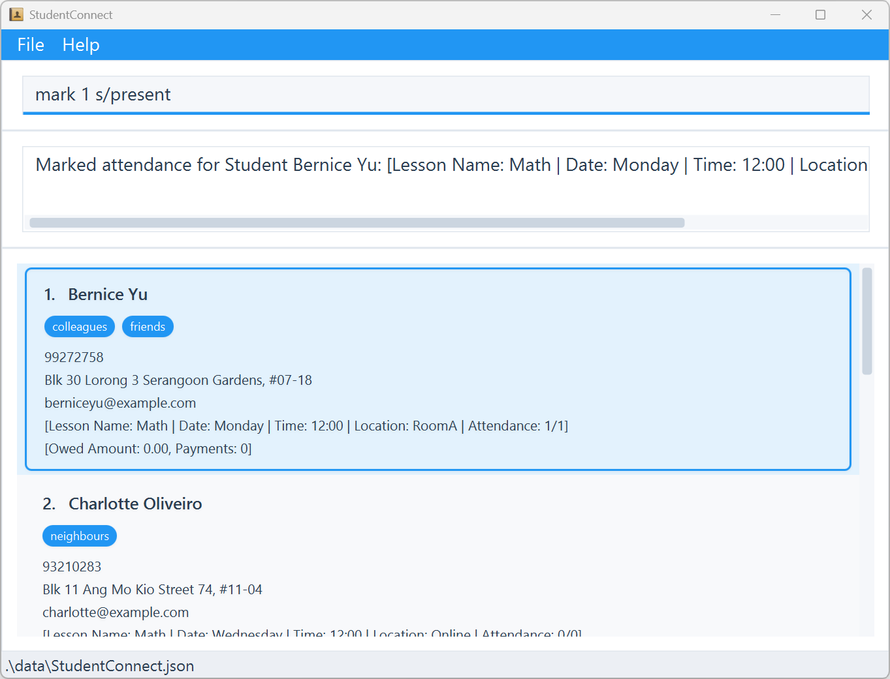
  <figcaption><em>Marks the 1st person in the displayed student list as present</em></figcaption>
</figure>

### Viewing weekly schedule : `schedule`

**Shows the weekly schedule of lessons** in StudentConnect.

Format:
```
schedule
```

> 💡 **Tip:**
> * This uses your computer’s current date to determine the week window.
> * Only lessons that fall within this week (Mon–Sun) are shown, sorted by day and time.
> * If there are no lessons this week, an empty schedule message is displayed.

Example:
```
schedule
```
<figure>
  
  <figcaption><em>Shows the weekly schedule of lessons</em></figcaption>
</figure>

## Managing Finances

### Adding outstanding fee : `addfee`

**Adds an outstanding fee** owed by a student in StudentConnect.

Format:
```
addfee INDEX amt/AMOUNT
```

> 💡 **Tip:**
> * `INDEX`: Refers to the index number shown in the displayed student list (1, 2, 3, …).
> * `AMOUNT`: A number up to 2 decimal places between 0.00 and 1,000,000.00 (inclusive). Maximum outstanding amount is
> $1,000,000.00.

Example:
```
addfee 1 amt/150
```
<figure>
  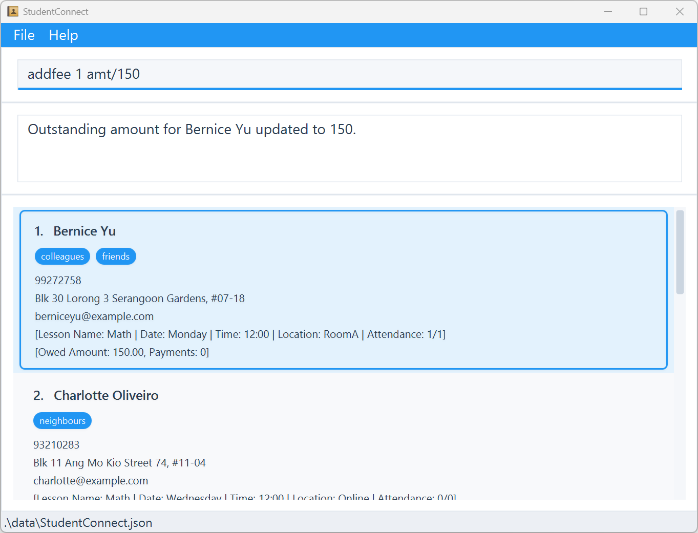
  <figcaption><em>Adds $150 of outstanding fee to the 1st person in the displayed student list</em></figcaption>
</figure>

### Adding payment : `pay`

**Adds a payment** made by a student in StudentConnect.

Format:
```
pay INDEX amt/AMOUNT
```

> 💡 **Tip:**
> * `INDEX`: Refers to the index number shown in the displayed student list (1, 2, 3, …).
> * `AMOUNT`: A number up to 2 decimal places between 0.00 and current owed amount (inclusive).

Example:
```
pay 1 amt/150
```
<figure>
  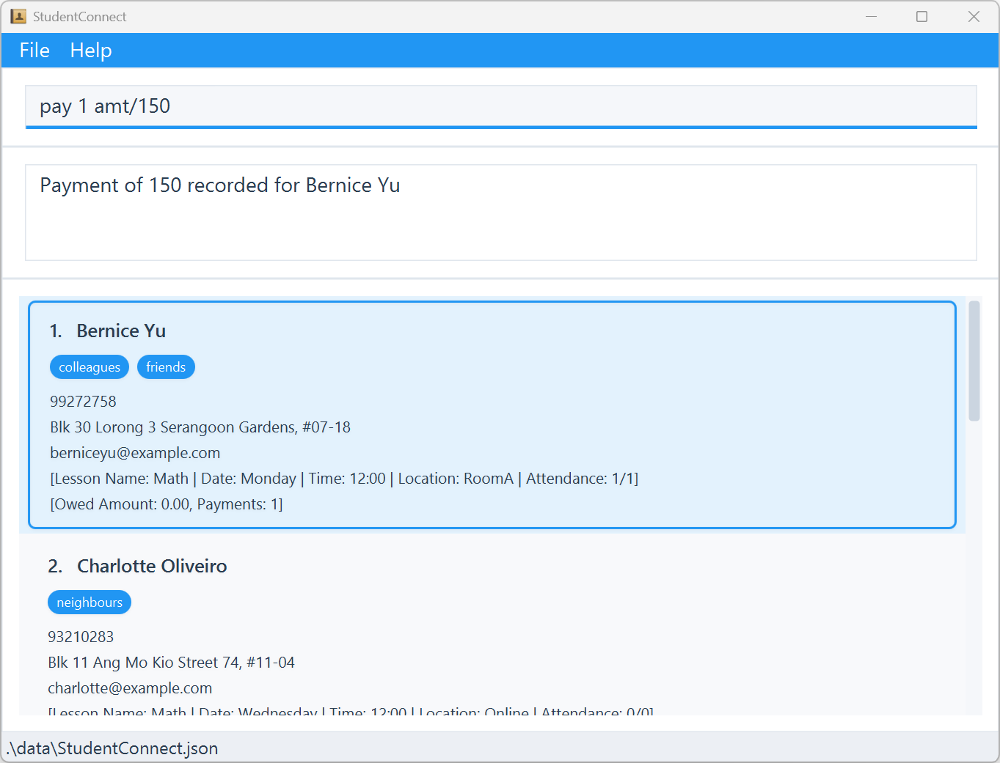
  <figcaption><em>Deducts $150 of outstanding amount from the 1st person in the displayed student list</em></figcaption>
</figure>

### Viewing payment history : `payments`

**Shows the payment history** in StudentConnect.

Format:
```
payments
```

> 💡 **Tip:**<br>
> This shows payment history sorted by latest.

Example:
```
payments
```
<figure>
  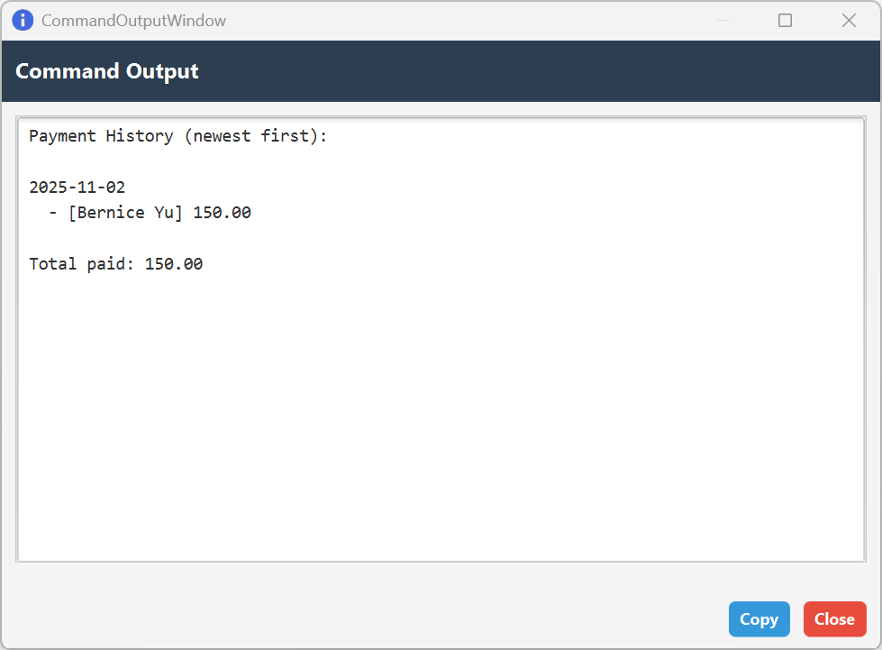
  <figcaption><em>Shows the payment history</em></figcaption>
</figure>

### Viewing outstanding payments : `outstanding`

**Shows all the outstanding payments** in StudentConnect.

Format:
```
outstanding
```

Example:
```
outstanding
```
<figure>
  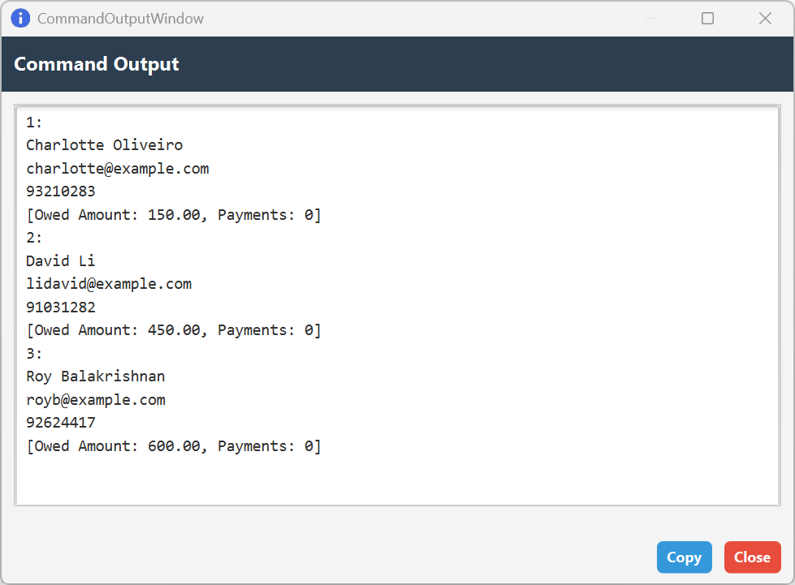
  <figcaption><em>Shows all outstanding payments</em></figcaption>
</figure>

## Managing Data Files

### Saving data

StudentConnect **automatically** saves your data after any action that makes changes. You don’t need to worry about saving
manually.

### Importing data file

**Imports a data file** into StudentConnect.

1. Go to `File->Import`.
2. Select the `.json` file that you want to import.

> 💡 **Tip:**
> * On success, the imported data will overwrite current data.
> * On failure, an error message will appear and no data is changed.
> * Only JSON files following StudentConnect's format will be accepted.
> * You should create a backup using export.

### Exporting data file

**Exports the current data** from StudentConnect.

1. Go to `File->Export`.
2. Choose the folder that you want to export the file to.

> 💡 **Tip:**
> * Exported files can be used on any computer with StudentConnect.
> * Export does not change your current data.
> * You can keep multiple timestamped exports as backups.

### Editing data file

AddressBook data are saved automatically as a JSON file `[JAR file location]/data/StudentConnect.json`. Advanced users
are welcome to update data directly by editing that data file.

> ⚠️ **Warning:**<br>
> If your changes to the data file makes its format invalid, StudentConnect will discard the invalid data and only load
> the valid data. Hence, it is recommended to take a backup of the file before editing it. Furthermore, certain edits
> can cause the StudentConnect to behave in unexpected ways (e.g., if a value entered is outside the acceptable range).
> Therefore, edit the data file only if you are confident that you can update it correctly.

## Exiting

### Exiting program : `exit`

**Exits the program**.

Format: `exit`

> 💡 **Tip:**
> There are other ways to exit the program, such as `File->Exit` or `X` button.

--------------------------------------------------------------------------------------------------------------------

# FAQ

**Q**: How do I transfer my data to another Computer?<br>
**A**: Install the app in the other computer and import the data file that is exported by your previous StudentConnect.

--------------------------------------------------------------------------------------------------------------------

# Known issues

1. **Multiple Screens**: If you move the application to a secondary screen, and later switch to using only
the primary screen, the GUI will open off-screen. You should just delete the `preferences.json` file created by the
application before running the application again.
2. **Help Window**: If you minimize the help window and then run the `help` command (or use the `Help` menu, or the
keyboard shortcut `F1`) again, the original Help Window will remain minimized. You should just restore the help window
manually.

--------------------------------------------------------------------------------------------------------------------

# Command summary

| Action                           | Format, Examples                                                                                                                                           |
|----------------------------------|------------------------------------------------------------------------------------------------------------------------------------------------------------|
| **Adding student**               | `add n/NAME p/PHONE_NUMBER e/EMAIL addr/ADDRESS [tag/TAG]…` <br> e.g., `add n/John Doe p/98765432 e/johnd@example.com addr/John street, block 123, #01-01` |
| **Editing student**              | `edit INDEX [n/NAME] [p/PHONE] [e/EMAIL] [addr/ADDRESS] [tag/TAG]…`<br> e.g.,`edit 1 p/91234567 e/johndoe@example.com`                                     |
| **Finding students by name**     | `find KEYWORD [MORE_KEYWORDS]...`<br> e.g., `find alex david`                                                                                              |
| **Finding students by tag**      | `findtag TAG_NAME [MORE_TAGNAMES]...`<br> e.g., `findtag friends`                                                                                          |
| **Deleting student**             | `delete INDEX`<br> e.g., `delete 1`                                                                                                                        |
| **Listing all students**         | `list`<br> e.g., `list`                                                                                                                                    |
| **Clearing all students**        | `clear`<br> e.g., `clear`                                                                                                                                  |
| **Adding lesson**                | `addlesson INDEX n/NAME d/DAY t/TIME loc/LOCATION`<br> e.g., `addlesson 1 n/Math d/Monday t/12:00 loc/RoomA`                                               |
| **Marking attendance**           | `mark INDEX s/STATUS`<br> e.g., `mark 1 s/present`                                                                                                         |
| **Viewing weekly schedule**      | `schedule`<br> e.g., `schedule`                                                                                                                            |
| **Adding outstanding fee**       | `addfee INDEX amt/AMOUNT`<br>e.g., `addfee 1 amt/150`                                                                                                      |
| **Adding payment**               | `pay INDEX amt/AMOUNT`<br> e.g., `pay 1 amt/150`                                                                                                           |
| **Viewing payment history**      | `payments`<br> e.g., `payments`                                                                                                                            |
| **Viewing outstanding payments** | `outstanding`<br> e.g., `outstanding`                                                                                                                      |
| **Exiting program**              | `exit`<br> e.g., `exit`                                                                                                                                    |
