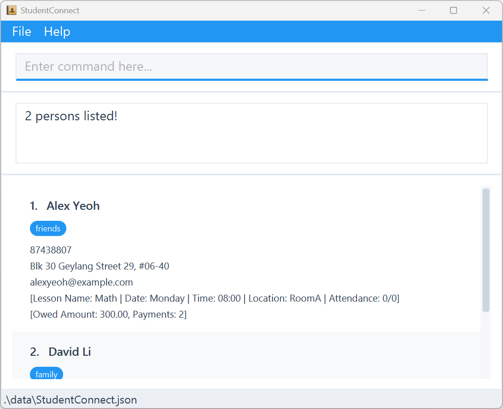

**Welcome to _StudentConnect_!**

**StudentConnect** is an easy-to-use app that **helps private tutors keep track of their students, lessons, attendance
and payments**. It’s designed to help you work faster and stay organized. You simply type short
commands, and your information appears neatly on the screen.

**_Don’t worry if you’re not good with computers!_** StudentConnect includes clear, step-by-step instructions to guide
you from installing the program to getting started. You’ll be up and running in just a few minutes.

<div markdown="span" class="alert alert-primary">
For **new users**, start with the [_**Quick Start**_](#quick-start) section to learn how to install and launch the app.
Then, explore the [_**Features**_](#features) section to discover what you can do. Each command is explained with
examples so you can easily follow along.

For **experienced users**, check out the [_**Command Summary**_](#command-summary) to quickly look up any command
format.

For **troubleshooting or common questions**, check out the [_**FAQ**_](#faq) and [_**Known Issues**_](#known-issues)
sections at the end.

You can jump to any section using the **Table of Contents** below.
</div>

* Table of Contents
{:toc}

--------------------------------------------------------------------------------------------------------------------

# Quick start

## Installation

1. **Check your computer’s setup**<br>
   Make sure you have Java 17 or a newer version installed.<br>
   **Non-Mac users:** Download and install Java 17 [here](https://www.oracle.com/java/technologies/javase/jdk17-archive-downloads.html).<br>
   **Mac users:** Follow the instructions [here](https://se-education.org/guides/tutorials/javaInstallationMac.html).<br>
<br>
2. **Download StudentConnect**<br>Get the latest version of the app by downloading the `.jar` file from [here](https://github.com/AY2526S1-CS2103T-T14-1/tp/releases).<br>
<br>
3. **Choose where to save it**<br>Move the downloaded file to a folder where you want to keep your StudentConnect files.
   _(This will be your “home folder” for the app.)_<br>
<br>
4. **Open the app**<br>
   * Open the Command Prompt (Windows) or Terminal (Mac).
   * Go to the folder where you saved the file by typing:
        ```bash
        cd path_to_your_folder
        ```
   * Then run this command:
        ```bash
        java -jar studentconnect.jar
        ```
   * The app will open in a few seconds and show some sample data so you can try it out.

<div markdown="span" class="alert alert-primary">
:bulb: <strong>Tip:</strong><br>
Start by typing <code>help</code> and pressing Enter to see this guide anytime you need help!
</div>

## Command Format

Before using the commands in StudentConnect, it helps to understand how they are written.
Here are a few simple rules to guide you:

### Basic Command Usage

* Type in **lowercase letters**
* Press **Enter** after typing
* Some commands need extra info (like a name or number)

### Understanding Command Format

* **Words in UPPER_CASE** are the parameters to be replaced.<br>
e.g. in `add n/NAME`, replace `NAME` with `John Doe`.<br>
<br>
* **Items in square brackets** are optional.<br>
e.g. `n/NAME [t/TAG]` can be used as `n/John Doe t/friend` or as `n/John Doe`.<br>
<br>
* **Items with `…`** after them can be used multiple times (including zero times).<br>
e.g. `[t/TAG]…` can be used as `t/friend`, `t/friend t/family` or not used at all.<br>
<br>
* **Parameters can be in any order.**<br>
e.g. `n/NAME p/PHONE` is the same as `p/PHONE n/NAME`.<br>
<br>
* **Extra parameters are ignored** for simple commands like `help`, `list`, `exit` and `clear`.<br>
e.g. `help 123` will be interpreted as `help`.<br>

<div markdown="span" class="alert alert-primary">
:bulb: <strong>Tip:</strong><br>
If you are using a PDF version of this document, be careful when copying and pasting commands that span multiple lines
as space characters surrounding line-breaks may be omitted when copied over to the application.
</div>

## User Interface Overview

The interface is designed to be intuitive and efficient for managing your students, lessons, attendance and payments.

### Main Interface


| #  | Description         |
|----|---------------------|
| 1  | Command Box         |
| 2  | Command Result      |
| 3  | Student Name        |
| 4  | Student Tags        |
| 5  | Student Details     |
| 6  | Data Directory      |
| 7  | Help (User Guide)   |
| 8  | Import Student List |
| 9  | Export Student List |
| 10 | Exit StudentConnect |

<div markdown="span" class="alert alert-primary">
:bulb: <strong>Tip:</strong><br>
You should scroll through long list using the scroll bar.
</div>

### Key Features

* **Real-Time Updates**: Contact and event lists refresh instantly after any changes.
* **Sample Data Included**: The app comes preloaded with sample contacts and events to help you get started quickly.
* **Responsive Design**: The interface adapts seamlessly to different screen sizes and remains smooth even with hundreds
of contacts and events.
* **Clear Visual Feedback**: Every action provides immediate success or error messages for better user guidance.

--------------------------------------------------------------------------------------------------------------------

# Features

## Managing Students

### Adding student : `add`

**Adds a student** to StudentConnect.

**Format:**
```
add n/NAME p/PHONE e/EMAIL addr/ADDRESS [tag/TAG]…
```

<div markdown="span" class="alert alert-primary">
:bulb: <strong>Tip:</strong>
<ul>
    <li><code>NAME</code>: Alphanumeric characters with <code>/</code>, <code>'</code>, <code>.</code>, <code>-</code>
    and spaces only. Maximum 50 characters.</li>
    <li><code>PHONE</code>: Numbers only, at least 3 digits. Maximum 20 digits.</li>
    <li><code>EMAIL</code>: Valid email format. Maximum 50 characters.</li>
    <li><code>ADDRESS</code>: Alphanumeric characters with <code>/</code>, <code>#</code>, <code>-</code>,
    <code>.</code>, <code>,</code> and spaces only.</li>
    <li><code>TAG</code>: Alphanumeric characters only. Maximum 15 characters per tag.</li>
</ul>
</div>

Example:
```
add n/John Doe p/98765432 e/johnd@example.com addr/John street, block 123, #01-01
```
<div style="display: flex; justify-content: space-between; align-items: center;">
  
</div>
<p><em>Adds a student with name <code>John Doe</code>, phone <code>98765432</code>, email <code>johnd@example.com</code>
    and address <code>John street, block 123, #01-01</code></em></p>

### Editing student : `edit`

**Edits an existing student** in StudentConnect.

Format:
```
edit INDEX [n/NAME] [p/PHONE] [e/EMAIL] [addr/ADDRESS] [tag/TAG]…
```

<div markdown="span" class="alert alert-primary">
:bulb: <strong>Tip:</strong>
<ul>
    <li><code>NAME</code>: Alphanumeric characters with <code>/</code>, <code>'</code>, <code>.</code>, <code>-</code>
    and spaces only. Maximum 50 characters.</li>
    <li><code>PHONE</code>: Numbers only, at least 3 digits. Maximum 20 digits.</li>
    <li><code>EMAIL</code>: Valid email format. Maximum 50 characters.</li>
    <li><code>ADDRESS</code>: Alphanumeric characters with <code>/</code>, <code>#</code>, <code>-</code>,
    <code>.</code>, <code>,</code> and spaces only.</li>
    <li><code>TAG</code>: Alphanumeric characters only. Maximum 15 characters per tag.</li>
    <li><strong>At least one</strong> of the optional fields must be provided.</li>
    <li>To remove all the student’s tags, you should type <code>tag/</code> without specifying any tags after it.</li>
</ul>
</div>

<div markdown="span" class="alert alert-warning">
:warning: <strong>Warning:</strong><br>
This will <strong>overwrite</strong> the existing tags. Please be <strong>very sure</strong> before you enter the
command. To <strong>append</strong> a new tag, you should retype existing tags with the new tag to append.
</div>

Example:
```
edit 1 p/91234567 e/johndoe@example.com
```
<div style="display: flex; justify-content: space-between; align-items: center;">
  
</div>
<p><em>Edits the phone number and email address of the 1st person to be <code>91234567</code> and
    <code>johndoe@example.com</code> respectively</em></p>

### Finding students by name : `findname`

**Finds existing students by name** in StudentConnect.

Format:
```
findname KEYWORD [MORE_KEYWORDS]...
```

<div markdown="span" class="alert alert-primary">
:bulb: <strong>Tip:</strong>
<ul>
    <li>The search is case-insensitive.</li>
    <li>The order of the keywords does not matter.</li>
    <li>Only the name is searched.</li>
    <li>Only full words will be matched. <strong>This is different from <code>findtag</code>.</strong></li>
    <li>Students matching at least one keyword will be returned (i.e. <code>OR</code> search).</li>
</ul>
</div>

Example:
```
findname alex david
```
<div style="display: flex; justify-content: space-between; align-items: center;">
  
</div>
<p><em>Finds students whose names match either <code>alex</code> or <code>david</code></em></p>

### Finding students by tag : `findtag`

**Finds existing students by tag** in StudentConnect.

Format:
```
findtag TAG_NAME [MORE_TAGNAMES]...
```

<div markdown="span" class="alert alert-primary">
:bulb: <strong>Tip:</strong>
<ul>
    <li>The search is case-insensitive.</li>
    <li>The order of the keywords does not matter.</li>
    <li>Only the tag is searched.</li>
    <li>Partial words will be matched. <strong>This is different from <code>find</code>.</strong>></li>
    <li>Students matching at least one keyword will be returned (i.e. <code>OR</code> search).</li>
</ul>
</div> 

Example:
```
findtag friends
```
<div style="display: flex; justify-content: space-between; align-items: center;">
  
</div>
<p><em>Finds students whose tags partially match <code>friends</code></em></p>

### Deleting student : `delete`

**Deletes an existing student** in StudentConnect.

Format:
```
delete INDEX
```

<div markdown="span" class="alert alert-primary">
:bulb: <strong>Tip:</strong>
<ul>
    <li><code>INDEX</code>: Refers to the index number shown in the displayed student list (1, 2, 3, …).</li>
</ul>
</div>

<div markdown="span" class="alert alert-warning">
️:warning: <strong>Warning:</strong><br>
This will <strong>delete</strong> the existing student. Please be <strong>very sure</strong> before you enter the command.
</div>

Example:
```
delete 1
```
<div style="display: flex; justify-content: space-between; align-items: center;">
  
  
</div>
<p><em>Deletes the 1st person in the displayed student list</em></p>

### Listing all students : `list`

**List all students** in StudentConnect.

Format:
```
list
```

Example:
```
list
```
<div style="display: flex; justify-content: space-between; align-items: center;">
  
</div>
<p><em>Lists all students</em></p>

### Clearing all students : `clear`

**Clears all students** in StudentConnect.

Format:
```
clear
```

<div markdown="span" class="alert alert-warning">
:warning: <strong></strong>Warning:**<br>
This will <strong>clear</strong> all existing students. Please be <strong>very sure</strong>> before you enter the command.
</div>

Example:
```
clear
```
<div style="display: flex; justify-content: space-between; align-items: center;">
  
</div>
<p><em>Clears all students</em></p>

## Managing Lessons

### Adding lesson : `addlesson`

**Adds a lesson** to a student in StudentConnect.

Format:
```
addlesson INDEX n/NAME d/DAY t/TIME loc/LOCATION
```

<div markdown="span" class="alert alert-primary">
:bulb: <strong>Tip:</strong>
<ul>
    <li><code>INDEX</code>: Refers to the index number shown in the displayed student list (1, 2, 3, …).</li>
    <li><code>NAME</code>: Alphanumeric characters only.</li>
    <li><code>DAY</code>: <code>Monday</code>, <code>Tuesday</code>, <code>Wednesday</code>, <code>Thursday</code>, <code>Friday</code>, <code>Saturday</code> or <code>Sunday</code> (case-insensitive).</li>
    <li><code>TIME</code>: In <strong>hh:mm</strong> format.</li>
    <li><code>LOCATION</code>: Alphanumeric characters only.</li>
</ul>
</div>

<div markdown="span" class="alert alert-warning">
:warning: <strong>Warning:</strong><br>
A student can only have <strong>1</strong> lesson. This will <strong>overwrite</strong> any existing lesson for the student. Please be
<strong>very sure</strong> before you enter the command.
</div>

Example:
```
addlesson 1 n/Math d/Monday t/12:00 loc/RoomA
```
<div style="display: flex; justify-content: space-between; align-items: center;">
  
</div>
<p><em>Adds a lesson with name <code>Math</code> on <code>Monday</code> <code>12:00</code> at <code>RoomA</code> to the
    1st person in the displayed student list</em></p>

### Marking attendance : `mark`

**Marks the attendance** for a student in StudentConnect.

Format:
```
mark INDEX s/STATUS
```

<div markdown="span" class="alert alert-primary">
:bulb: <strong>Tip:</strong>
<ul>
    <li><code>INDEX</code>: Refers to the index number shown in the displayed student list (1, 2, 3, …).</li>
    <li><code>STATUS</code>: <code>present</code> or <code>absent</code> (case-insensitive).</li>
</ul>
</div>

Example:
```
mark 1 s/present
```
<div style="display: flex; justify-content: space-between; align-items: center;">
  
</div>
<p><em>Marks the 1st person in the displayed student list as present</em></p>

### Viewing weekly schedule : `schedule`

**Shows the weekly schedule of lessons** in StudentConnect.

Format:
```
schedule
```

<div markdown="span" class="alert alert-primary">
:bulb: <strong>Tip:</strong>
<ul>
    <li>This uses your computer’s current date to determine the week window.</li>
    <li>Only lessons that fall within this week (Mon–Sun) are shown, sorted by day and time.</li>
    <li>If there are no lessons this week, an empty schedule message is displayed.</li>
</ul>
</div>

Example:
```
schedule
```
<div style="display: flex; justify-content: space-between; align-items: center;">
  
</div>
<p><em>Shows the weekly schedule of lessons</em></p>

## Managing Finances

### Adding outstanding fee : `addfee`

**Adds an outstanding fee** owed by a student in StudentConnect.

Format:
```
addfee INDEX amt/AMOUNT
```

<div markdown="span" class="alert alert-primary">
:bulb: <strong>Tip:</strong>
<ul>
    <li><code>INDEX</code>: Refers to the index number shown in the displayed student list (1, 2, 3, …).</li>
    <li><code>AMOUNT</code>: A number up to 2 decimal places between 0.00 and 1,000,000.00 (inclusive). Maximum outstanding amount
    is $1,000,000.00.</li>
</ul>
</div>

Example:
```
addfee 1 amt/150
```
<div style="display: flex; justify-content: space-between; align-items: center;">
  
</div>
<p><em>Adds $150 of outstanding fee to the 1st person in the displayed student list</em></p>

### Adding payment : `pay`

**Adds a payment** made by a student in StudentConnect.

Format:
```
pay INDEX amt/AMOUNT
```

<div markdown="span" class="alert alert-primary">
:bulb: <strong>Tip:</strong>
<ul>
    <li><code>INDEX</code>: Refers to the index number shown in the displayed student list (1, 2, 3, …).</li>
    <li><code>AMOUNT</code>: A number up to 2 decimal places between 0.00 and current owed amount (inclusive).</li>
</ul>
</div>

Example:
```
pay 1 amt/150
```
<div style="display: flex; justify-content: space-between; align-items: center;">
  
</div>
<p><em>Deducts $150 of outstanding amount from the 1st person in the displayed student list</em></p>

### Viewing payment history : `payments`

**Shows the payment history** in StudentConnect.

Format:
```
payments
```

<div markdown="span" class="alert alert-primary">
:bulb: <strong>Tip:</strong><br>
This shows payment history sorted by latest.
</div>

Example:
```
payments
```
<div style="display: flex; justify-content: space-between; align-items: center;">
  
</div>
<p><em>Shows the payment history</em></p>

### Viewing outstanding payments : `outstanding`

**Shows all the outstanding payments** in StudentConnect.

Format:
```
outstanding
```

Example:
```
outstanding
```
<div style="display: flex; justify-content: space-between; align-items: center;">
  
</div>
<p><em>Shows all outstanding payments</em></p>

## Managing Data Files

### Saving data

StudentConnect **automatically** saves your data after any action that makes changes. You don’t need to worry about saving
manually.

### Importing data file

**Imports a data file** into StudentConnect.

1. Go to `File->Import`.
2. Select the `.json` file that you want to import.

<div markdown="span" class="alert alert-primary">
:bulb: <strong>Tip:</strong>
<ul>
    <li>On success, the imported data will overwrite current data.</li>
    <li>On failure, an error message will appear and no data is changed.</li>
    <li>Only JSON files following StudentConnect's format will be accepted.</li>
    <li>You should create a backup using export.</li>
</ul>
</div>

### Exporting data file

**Exports the current data** from StudentConnect.

1. Go to `File->Export`.
2. Choose the folder that you want to export the file to.

<div markdown="span" class="alert alert-primary">
:bulb: <strong>Tip:</strong>
<ul>
    <li>Exported files can be used on any computer with StudentConnect.</li>
    <li>Export does not change your current data.</li>
    <li>You can keep multiple timestamped exports as backups.</li>
</ul>
</div>

### Editing data file

AddressBook data are saved automatically as a JSON file `[JAR file location]/data/StudentConnect.json`. Advanced users
are welcome to update data directly by editing that data file.

<div markdown="span" class="alert alert-warning">
:warning: <strong>Warning:</strong><br>
If your changes to the data file makes its format invalid, StudentConnect will discard the invalid data and only load
the valid data. Hence, it is recommended to take a backup of the file before editing it. Furthermore, certain edits
can cause the StudentConnect to behave in unexpected ways (e.g., if a value entered is outside the acceptable range).
Therefore, edit the data file only if you are confident that you can update it correctly.
</div>

## Exiting

### Exiting program : `exit`

**Exits the program**.

Format: `exit`

<div markdown="span" class="alert alert-primary">
:bulb: <strong>Tip:</strong><br>
There are other ways to exit the program, such as <code>File->Exit</code> or <code>X</code> button.
</div>

--------------------------------------------------------------------------------------------------------------------

# FAQ

**Q**: I don’t know how to open the Command Prompt (Windows) or Terminal (Mac). What should I do?<br>
**A**:
* **Windows**: Click the **Start** button → type `cmd` → press **Enter**.
* **Mac**: Press **Command + Space** → type `Terminal` → press **Enter**.<br>
Once opened, you can type commands as shown in this guide.

**Q**: How do I know where I saved the `.jar` file?<br>
**A**: Look in your **Downloads** folder first, that’s usually where files go when downloaded. If you still can’t find it,
search your computer for `studentconnect.jar`.

**Q**: When I type the command to open StudentConnect, it says “file not found.” What do I do?<br>
**A**: You may not be in the right folder. Try typing `dir` (Windows) or `ls` (Mac) to see a list of files. If you don’t see
`studentconnect.jar`, move into the correct folder using `cd path_to_your_folder` before running the command again.

**Q**: I can’t type or paste properly in the Command Prompt.<br>
**A**: Try clicking inside the Command Prompt window first. To paste text:
* **Windows**: Right-click anywhere in the window.
* **Mac Terminal**: Press Command + V.

**Q**: I don’t understand what `cd` means.<br>
**A**: `cd` means “change directory.” It tells your computer to go into a specific folder.

**Q**: Do I have to type everything exactly the same as in the examples?<br>
**A**: Not exactly, you can replace words like NAME or ADDRESS with your own. However, make sure to type the command
format **exactly** (e.g., spaces and `/` symbols matter).

**Q**: Can I close the app by clicking the “X” button instead of typing `exit`?<br>
**A**: Yes! Both work. You can click the **X** in the top-right corner of the window or type `exit` and press **Enter**.

**Q**: Will I lose my data if I close the app?<br>
**A**: No. StudentConnect automatically saves your data every time you make a change, even if you close the app without
typing `exit`.

**Q**: What should I do if the app doesn’t open?<br>
**A**: Try these steps one by one:
1. Check that **Java 17 or newer** is installed.
2. Make sure you typed the command correctly:
```bash
java -jar studentconnect.jar
```
3. If it still doesn’t work, move the `.jar` file to a simple folder like `C:\StudentConnect` (Windows) or `Documents`
(Mac) and try again. 
4. If the error message mentions Java, reinstall Java from the links in the **Quick Start** section.

**Q**: How can I make a backup of my data?<br>
**A**: Use the **Export** option (`File -> Export`) and save the file somewhere safe, like your Desktop or a USB drive.
You can import it later if anything goes wrong.

**Q**: What happens if I delete the wrong student or clear all data?<br>
**A**: Once deleted, data cannot be recovered unless you have a backup. That’s why it’s a good idea to
**export your data regularly**.

**Q**: I accidentally edited or deleted something. Can I undo it?<br>
**A**: Currently, StudentConnect does not support an “undo” feature. To restore data, you can **re-import** a backup
file if you have one.

**Q**: The screen looks too small or too big. How do I fix it?<br>
**A**: You can resize the window by clicking and dragging its corners. If the text is too small, you can increase your
computer’s display zoom in the system settings.

**Q**: What should I do if I see a lot of red error messages?<br>
**A**: Don’t worry! It just means the app couldn’t understand your command. Read the message, it usually tells you what
went wrong. You can also type `help` to see the correct command format.

**Q**: How do I transfer my data to another Computer?<br>
**A**: Install the app in the other computer and import the data file that is exported by your previous StudentConnect.

--------------------------------------------------------------------------------------------------------------------

# Known issues

1. **Multiple Screens**: If you move the application to a secondary screen, and later switch to using only
the primary screen, the GUI will open off-screen. You should just delete the `preferences.json` file created by the
application before running the application again.
2. **Help Window**: If you minimize the help window and then run the `help` command (or use the `Help` menu, or the
keyboard shortcut `F1`) again, the original Help Window will remain minimized. You should just restore the help window
manually.

--------------------------------------------------------------------------------------------------------------------

# Command summary

| Action                           | Format, Examples                                                                                                                                    |
|----------------------------------|-----------------------------------------------------------------------------------------------------------------------------------------------------|
| **Adding student**               | `add n/NAME p/PHONE e/EMAIL addr/ADDRESS [tag/TAG]…` <br> e.g., `add n/John Doe p/98765432 e/johnd@example.com addr/John street, block 123, #01-01` |
| **Editing student**              | `edit INDEX [n/NAME] [p/PHONE] [e/EMAIL] [addr/ADDRESS] [tag/TAG]…`<br> e.g.,`edit 1 p/91234567 e/johndoe@example.com`                              |
| **Finding students by name**     | `findname KEYWORD [MORE_KEYWORDS]...`<br> e.g., `findname alex david`                                                                               |
| **Finding students by tag**      | `findtag TAG_NAME [MORE_TAGNAMES]...`<br> e.g., `findtag friends`                                                                                   |
| **Deleting student**             | `delete INDEX`<br> e.g., `delete 1`                                                                                                                 |
| **Listing all students**         | `list`<br> e.g., `list`                                                                                                                             |
| **Clearing all students**        | `clear`<br> e.g., `clear`                                                                                                                           |
| **Adding lesson**                | `addlesson INDEX n/NAME d/DAY t/TIME loc/LOCATION`<br> e.g., `addlesson 1 n/Math d/Monday t/12:00 loc/RoomA`                                        |
| **Marking attendance**           | `mark INDEX s/STATUS`<br> e.g., `mark 1 s/present`                                                                                                  |
| **Viewing weekly schedule**      | `schedule`<br> e.g., `schedule`                                                                                                                     |
| **Adding outstanding fee**       | `addfee INDEX amt/AMOUNT`<br>e.g., `addfee 1 amt/150`                                                                                               |
| **Adding payment**               | `pay INDEX amt/AMOUNT`<br> e.g., `pay 1 amt/150`                                                                                                    |
| **Viewing payment history**      | `payments`<br> e.g., `payments`                                                                                                                     |
| **Viewing outstanding payments** | `outstanding`<br> e.g., `outstanding`                                                                                                               |
| **Exiting program**              | `exit`<br> e.g., `exit`                                                                                                                             |
